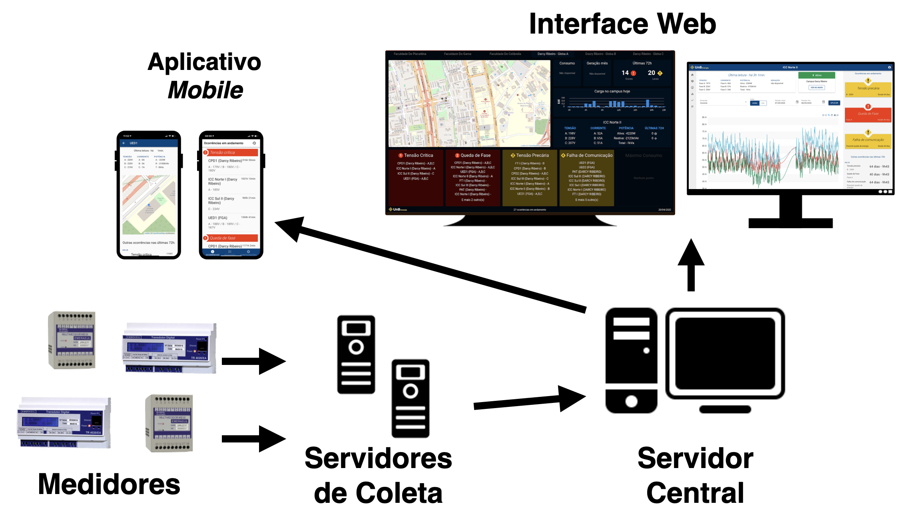
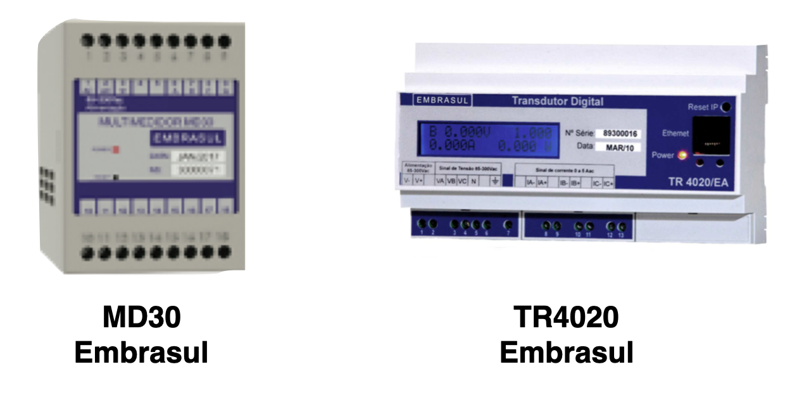

# SIGE - Sistema de Gestão Energética 

[Documentação Online](https://lappis-unb.gitlab.io/projects/SMI/docs)

## O que é o SIGE?
O Sistema de Gestão Energética - Universidade de Brasília (SIGE-UnB), consiste em uma aplicação web desenvolvida para auxiliar o monitoramento e gestão das instalações elétricas das edificações dos campi da Universidade de Brasília. A ideia visa que cada Campus contido na UnB possa ser capaz de utilizar a ferramenta e ter um maior conhecimento de como está o consumo de seus insumos importantes ao longo do tempo, possibilitando, assim, elaborar possíveis estratégias que auxiliem em sua economia.

## Qual problema o SIGE se propõe a resolver?

Atualmente, a UnB e outras instituições de ensino superior do país somente possuem o medidor geral de consumo de energia e, portanto, impedem qualquer avaliação localizada. Ou seja, os gestores desses orgãos públicos não possuem dados sobre a qualidade energética de prédios específicos, linhas de transmissão, faculdades, etc. Essa carência de dados impede a prática de manutenções preventivas e ações remediativas, o que por usa vez acarreta em danos materiais (danificação de infraestrutura, equipamentos queimandos, etc). 

O SIGE se propõe a coletar dados sobre a qualidade energética de diversos locais da infraestrutura de rede, para assim possibilitar a caracterização de perfis de consumo de cada edifício, aplicação de metodologias de gestão de consumo individualizada, melhorias na continuidade do fornecimento de energia da rede interna da UnB, além de definição de metas de redução de consumo e demanda, por unidade acadêmica.

## Arquitetura
A arquitetura do SIGE é composta por 4 camadas. Dois serviços de backend e dois de frontend conforme a imagem abaixo.


### Tecnologias do Projeto
- [VueJS](https://vuejs.org/) - Usado na implementação do frontend do projeto
- [Django REST](https://www.django-rest-framework.org/) - Usado para implementar as APIs master e slave
- [PostgreSQL](https://www.postgresql.org/) - Utilizado para o Banco de Dados do master e slave

### Servidor de Coleta de dados (sige-slave)

O **Servidor de Coleta de Dados** é a camada responsável por coletar periodicamente os dados dos medidores de energia (tensão, corrente, consumo e geração de energia, potência ativa/reativa/total, dentre outros) e disponibilizá-los ao *Servidor Central* através de uma API-REST. A arquitetura do SIGE permite o uso de um ou mais servidores de coleta distribuídos para assegurar a coleta de dados em caso de falhas de conexão entre os campi da universidade.   

As conexões com os *medidores* são realizadas periodicamente:

- **Minutely** - A cada minuto
- **Quarterly** - A cada 15 minutos
- **Monthly** - Mensalmente

Para saber mais sobre este módulo acesse [Slave](./slave/home)

#### Medidores (Transducers)

Os *medidores de energia* utilizados no projeto são multimedidores de mercado com protocolo aberto que medem as grandezas elétricas essenciais em sistemas de gestão de energia. Dentre os protocolos de comunicação usados estão o Modbus RTU / Modbus TCP conectados via Ethernet.



Para saber mais sobre os Medidores acesse [Medidores](./medidores/home)  

### Servidor Central (sige-master)
O **Servidor Central** é a camada do sistema que concentra os dados de medidas de todos os *Servidores de Coleta* e fornece os dados coletados para o frontend através de uma API-REST. Seus dados são coletados a por conexões periódicas com o *Servidor de Coletas*.

As conexões do *Servidor Central* com os *Servidores de Coleta* são realizadas periodicamente:
- A cada 1 minuto para atualizar o resumo de medidas e eventos;
- A cada 1 hora para realizar a copia de todos os dados coletados dos medidores.

Para saber mais sobre este módulo acesse [Master](./master/home)  

### Interface Gráfica WEB (sige-front)
Apresenta dashboards para analisar os dados coletados pelos transdutores. Os dados do frontend são coletados a partir do *Servidor Central*.

Para saber mais sobre este módulo acesse [FrontEnd](./frontend/home)

### App Mobile - WPA (sige-mobile)
O App mobile é a versão de frontend desenvolvida para o acesso rápido aos eventos (ocorrências), estado dos medidores e envio de notificações. Os dados do frontend são coletados a partir do *Servidor Central*.

Para saber mais sobre este módulo acesse [Mobile](./mobile/home)

### Coordenação do Projeto
|        Membro       |            E-mail            |     GitLab     |
|:-------------------:|:----------------------------:|:--------------:| 
|      Loana Velasco     |     loana@unb.br     |   -   |
|      Alex Reis     |     alexreis@unb.br     |   @REIALEX   |
|    Renato Coral     | renatocoral@unb.br | @renatocoral |

### Equipe
|        Membro       |            E-mail            |     GitLab     |
|:-------------------:|:----------------------------:|:--------------:| 
|      Álax Alves     |     alaxallves@gmail.com     |   @alaxalves   |
|    André de Sousa   |  andre.filho001@outlook.com  |  @andre-filho  |
|     Arthur Assis    |    arthur120496@gmail.com    |  @arthur0496   |
| Ezequiel de Oliveira | ezequiel1de1oliveira@gmail.com | @EzequielDeOliveira | 
| Gabriela Guedes | gabrielabguedes@gmail.com | @gabibguedes |
|  Guilherme Augusto  | guilherme.francais@gmail.com |  @guiaugusto   |
|    Lucas Martins    |  lucasamartins465@gmail.com  |  @lucasmartins |
| Renato Britto Araujo | renatobritto@protonmail.com | @renatoba |
|    Rodrigo Maia     | contato@rodmaia.com.br | @rodmaia |
|   Thalisson Melo    |   tallisonmelo@hotmail.com   | @thalissonmelo |

## Como subir 

Para criar o network é necessário subir o ambiente do slave primeiro. Para subir cada um dos ambientes rode o comando abaixo em cada um dos repositórios:
``` sh
docker-compose up
```
Se você não tem interesse em subir o ambiente do slave, basta criar um network para conectar com os outros ambientes, para isso rode o seguinte comando:
``` sh
docker network create smi-network
``` 
E suba o ambiente que preferir com:
``` sh
docker-compose up
```
Para ter a conexão do master com o slave é necessário cadastra-lo, para isso siga o seguinte [tutorial](./tutoriais/como-cadastrar-transdutor).

## Tutoriais
- [Como cadastrar um Transdutor e um Slave](./tutoriais/como-cadastrar-transdutor)
- [Como conectar com o Transdutor do Lappis](./tutoriais/conectar-transdutor-lappis)
