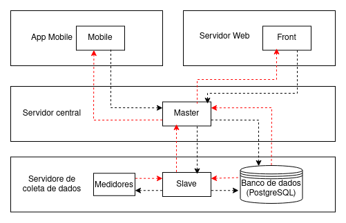

# Arquitetura do SIGE

O SIGE segue uma arquitetura em camadas, onde suas classes são organizadas em módulos de maior tamanho determinando assim por sua vez as camadas. Ao todo o SIGE possui 4 camadas:

1. Servidor de Coleta de Dados
2. Servidor Central
3. Servidor Web
4. App Mobile

Essas camadas se comunicam de maneira hierarquíca, a figura abaixo deixa claro como é reptesentada essa comunicação entre as camadas, e também o que está relacionado internamente com cada camada:
 
