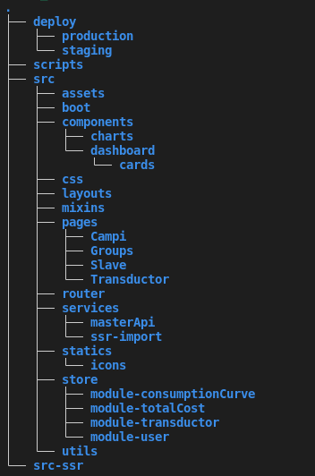
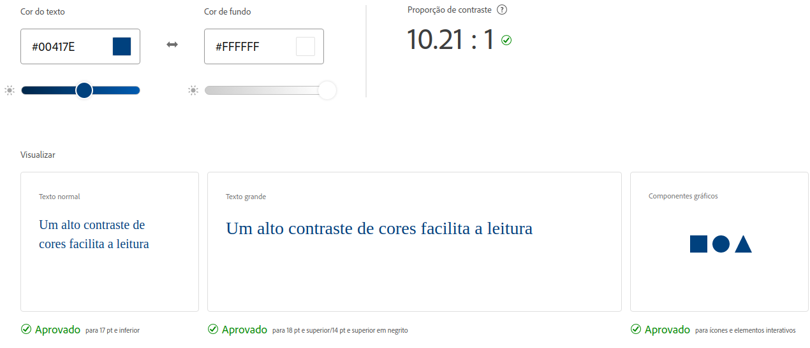

# Arquitetura - Front

## 1. Visão geral

O Sistema de Gestão Energética SIGE-UnB, desenvolvido pela Universidade de Brasília (Brasil) em parceria com a CEB (Companhia Energética de Brasília), é um aplicativo web desenvolvido para auxiliar no monitoramento e gerenciamento do consumo de energia da Universidade de Brasília e distribuição. 

Ele é construido utilizando o framework [Vue.js](https://vuejs.org/v2/guide/), javascript, html e scss.

## 2. Vue

Segundo a documentação do proprio Vue.js é uma estrutura progressiva para construir interfaces de usuário. Este é um framework que utiliza componentes, que utilizam de props e Eventos para se comunicar. 

A imagem abaixo mostra a estrutura de pastas do projeto:

Para mais informações relacionadas a o framework Vue.js segue o link da sua [documentação](https://vuejs.org/v2/guide/).

## 3. Quasar

Segundo o [wikipedia - quasar](https://en.wikipedia.org/wiki/Quasar_framework) Quasar é um framework de open source que tem como base Vue.JS que é utilizado para a construção de aplicativos, com uma única base de código, e ainda assim permite implantar na Web algumas tecnologias como SPA, PWA, SSR, para um aplicativo móvel, para este projete é utilizado o PWA.

## 4. Guia de estilo

O guia de estilo visual permite a unidade manter a coerência visual na apresentação de uma marca e dentro da sua oferta de serviços dentro do cenário digital.

### 4.1 Objetivo

Esse tópico tem como foco demonstrar os elementos de interfaces, garantindo que exista um serviço digital consistente, independente do seu alcance ou número de páginas.

Independente da situação, o guia de estilo deve agir como a âncora de confiança que mantém todas as intenções de design criativo corretamente interpretadas e traduzidas para todos que estão trabalhando no desenvolvimento. 

Alem disso também tem a função de facilitar o trabalho dos desenvolvedores front-end: quando eles podem utilizar componentes comuns em diversas páginas, sem precisar criar soluções do zero a todo momento, o desenvolvimento adquire bastante velocidade

### 4.2 Cores

Esta paleta inclui as cores primárias e secundárias do Sige. As cores base são utilizadas para manter a consistência.

### 4.3 Cor primária

As cores primárias são branco e azul na tonalidade informada na abaixo, que reflete as cores da UnB.

|Hexadecimal|RGB|Nome|
|-|-|-|
|#00417e |0, 65, 126, 1|Congress Blue|

### 4.4 Cor secundária

|Hexadecimal|RGB|Nome|
|-|-|-|
|#26a69a |38, 166, 154, 1|Congress Blue|

### 4.5 Contraste

Estas cores demonstram otimo contraste, além de possuir uma nota ótima em acessibilidade.

### 4.6 Marca

