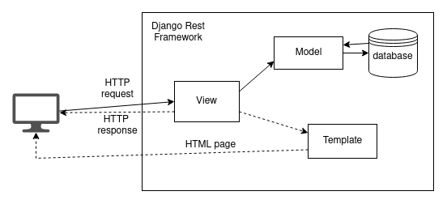
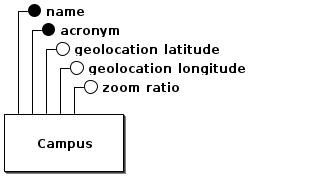
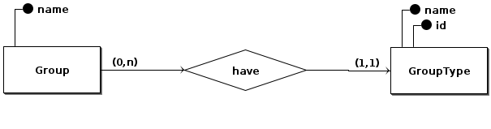
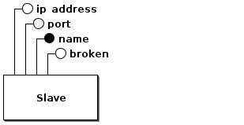
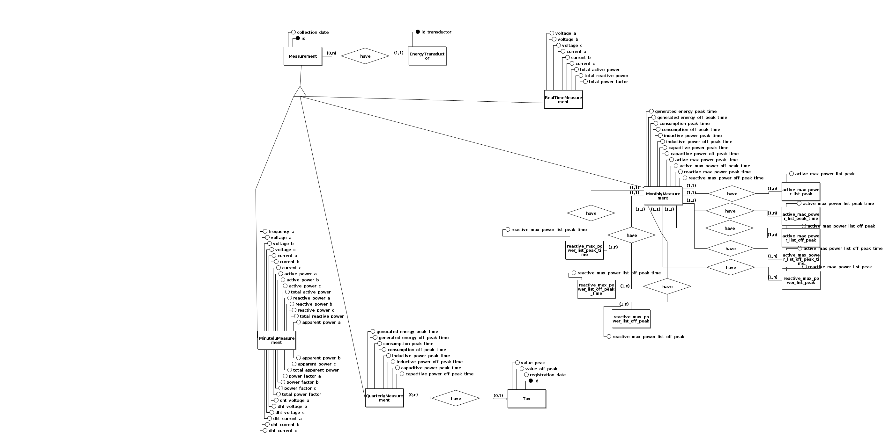
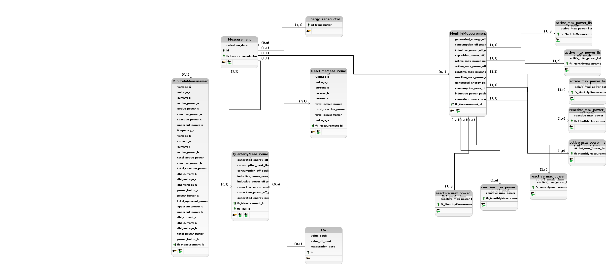

# Documentação sobre a API Master

## 1. Padrão arquitetural - MVT

A principal tecnologia utilizada nesse serviço é o DRF (Django Rest Framework) que gera uma API navegável que auxilia na usabilidade para os desenvolvedores. O Django Rest Framework divide a aplicação em um ou mais *apps* que por sua vez são responsaveis pela realização de funcionalidades relacionadas com o modelo de dados que estão associadas, dessa maneira podem ser executadas paralelamente. Atualmente a API Master está dividida, além dos já implementados por padrão no DRF, nos seguintes *apps* e funcionalidades:

- campi: gerenciamento dos campus e tarifas
- slaves: gerenciamento dos servidores de coleta
- measurements: medição dos dados provenientes dos transdutores
- transductors: gerenciamento dos transdutores
- users: gerenciamento de usuários
- events: gerenciamento de eventos em geral, como falha de conexão com om transductor e extrapolação do consumo contratado
- groups: gerenciamento de grupos
- unifilar_diagram: gerenciamento dos campus como um diagrama.

Cada um desses apps segue uma arquitetura bastante semelhante a arquitetura MVC (Model View Controller), o MVT (Model View Template), onde são utilizadas 3 camadas:

- Model: Modelagem de dados e suas regras de negócio
- View: Atende as requisições HTTP, executa uma funcionalidade e retorna uma resposta também em HTTP.
- Template: Página HTML para a exibição de uma resposta, caso necessário.

Na imagem acima podemos observar melhor como essa arquitetura funciona, a view tem duas maneiras de responder o usuário, seja acionando um template para retornar uma pagina HTML, ou diretamente com uma resposta HTTP.

## 2. Visão de Dados 

Devido a model presente no app de measurement ser bem grande, para melhor detalhamento, os arquivos feitos na ferramenta brModelo,
serão colocados na pasta "assets/brmodelo", permitindo possíveis atualização nos diagramas.
A ferramenta brModelo, pode ser baixado no site oficial: [http://www.sis4.com/brModelo/download.html](http://www.sis4.com/brModelo/download.html). Para execução, basta o seguinte comando, java -jar brModelo33.jar.

### 2.1 Diagrama MER(Modelo Entidade Relacionamento)

* Campus

* Group

* Slave

* Measurement

### 2.2 Diagrama DER(Diagrama Entidade Relacionamento)

* Measurement

