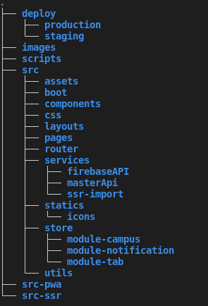

# Arquitetura - Mobile

## Visão geral

O SIGE (Sistema de Gestão Energética da Universidade de Brasília) mobile tem como foco fornecer dados de maneira rapida em campo para funcionarios que assim desejam. Para sua criação é utilizado PWA, isentando a necessidade de baixar um aplicativo para ter acesso ao Sige, ele é construido com o framework [Vue.js](https://vuejs.org/v2/guide/), juntamente javascript, html e Sass.

# PWA

Segundo a [wikipedia - PWA](https://en.m.wikipedia.org/wiki/Progressive_web_application) o PWA (progressive web application) consiste de um software de aplicativo que é distribuido pela web. Tendo como objetivo funcionar como esperado pelo desenvolvedor utilizando qualquer navegador compátivel com os padrões, seja desktop ou dispositivos móveis.

# Vue

Segundo a documentação do proprio Vue.js é uma estrutura progressiva para construir interfaces de usuário. Este é um framework que utiliza componentes, que utilizam de props e Eventos para se comunicar. 

A imagem abaixo mostra a estrutura de pastas do projeto:

Para mais informações relacionadas a o framework Vue.js segue o link da sua [documentação](https://vuejs.org/v2/guide/).