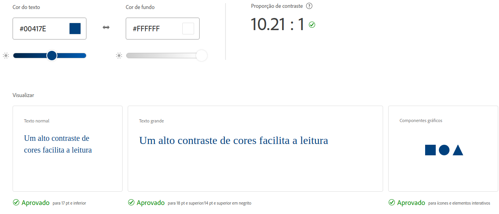

# Guia de estilo

#### Histórico de versão

| Data       | Versão | Descrição                                                 | Autor       |
| ---------- | ------ | --------------------------------------------------------- | ----------- |
| 10/02/2022 | 1.0    | Criação e ajuste dos tópicos do documentos                         | Leonardo Gomes |

### 1. Visão geral

O guia de estilo visual permite a unidade manter a coerência visual na apresentação de uma marca e dentro da sua oferta de serviços dentro do cenário digital.

### 2. Objetivo

Esse tópico tem como foco demonstrar os elementos de interfaces, garantindo que exista um serviço digital consistente, independente do seu alcance ou número de páginas.

Independente da situação, o guia de estilo deve agir como a âncora de confiança que mantém todas as intenções de design criativo corretamente interpretadas e traduzidas para todos que estão trabalhando no desenvolvimento. 

Alem disso também tem a função de facilitar o trabalho dos desenvolvedores front-end: quando eles podem utilizar componentes comuns em diversas páginas, sem precisar criar soluções do zero a todo momento, o desenvolvimento adquire bastante velocidade

### 3. Cores

Esta paleta inclui as cores primárias e secundárias do Sige. As cores base são utilizadas para manter a consistência.

#### 3.1 Cor primária

As cores primárias são branco e azul na tonalidade informada na abaixo, que reflete as cores da UnB.

|Hexadecimal|RGB|Nome|
|-|-|-|
|#00417e |0, 65, 126, 1|Congress Blue|

#### 3.2 Cor secundária

|Hexadecimal|RGB|Nome|
|-|-|-|
|#26a69a |38, 166, 154, 1|Congress Blue|

#### 3.3 Contraste

Estas cores demonstram otimo contraste, além de possuir uma nota ótima em acessibilidade.

### 4. Marca

Marca sem dúvidas é uma das partes mais importantes da aplicação, é a mesma que vai caracterizar e dar vida ao projeto. Sendo não só utilizado na aplicação, mas em todas as estruturas estéticas do projeto como documentos e apresetações.

